In this Article (Click to skip to that topic):

- [Blend: How to Combine 2 Images?](#what-is-yaml)
- [Draw Shapes & Text on Image](#why-yaml)
- [Draw a Polygon](#draw)
- [Blur an image](#blur)

`Pre Requesites:` Jupyter or any python editor

<h2 id='what-is-yaml'> Blend: How to Combine 2 Images?</h3>

_Blending in OpenCV is joining two images of same size into each other._

We can make cool posters, blend your loved ones picture with their favourite character on background and gift them, bring out your creativity and what not!

_Lets begin the magic!_

<br/>

```python
    import cv2  #opencv library
    import matplotlib.pyplot as plt # Matplotlib used for visualization
    %matplotlib inline

    # Reading the jpeg formmatted image from its path to img1
    img1=cv2.imread(r'./img/hp.JPG')

    # Reading the jpeg formatted image from its path to img2
    img2=cv2.imread(r'./img/doc.JPG')

    # Converting from BGR(blue,green,red) color space to RGB using cvtColor
    img1=cv2.cvtColor(img1,cv2.COLOR_BGR2RGB)
    img2=cv2.cvtColor(img2,cv2.COLOR_BGR2RGB)

    # Displaying the image 1
    plt.imshow(img1)

    # Displaying the image 2
    plt.imshow(img2)
```

**Output**:

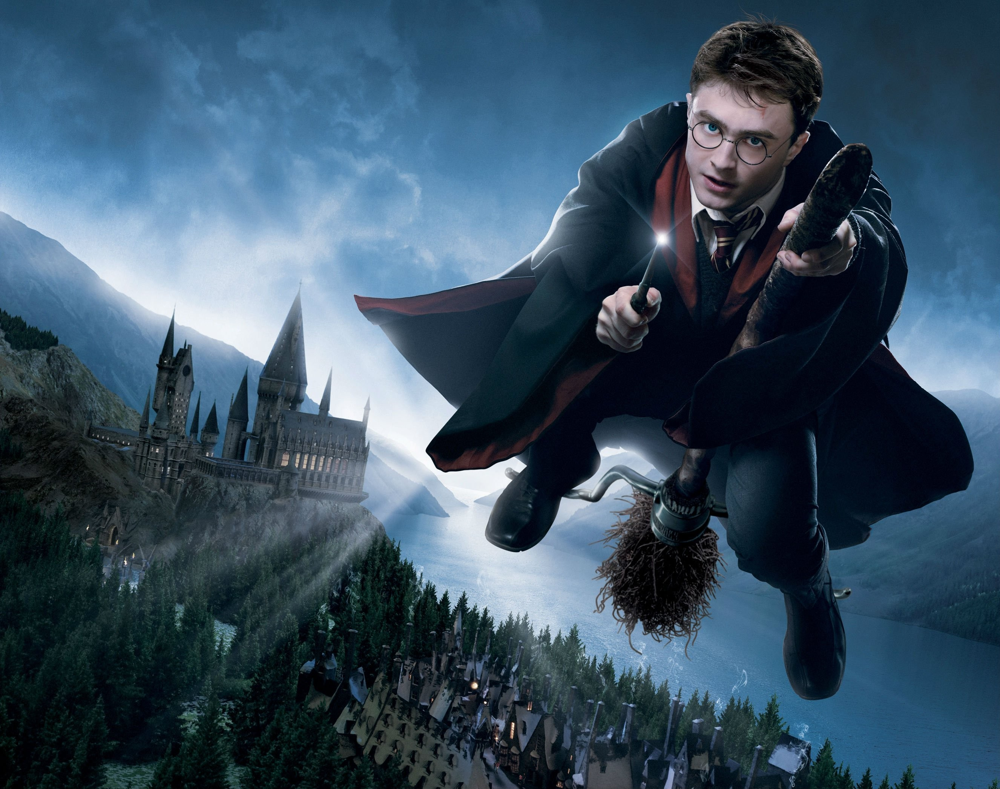

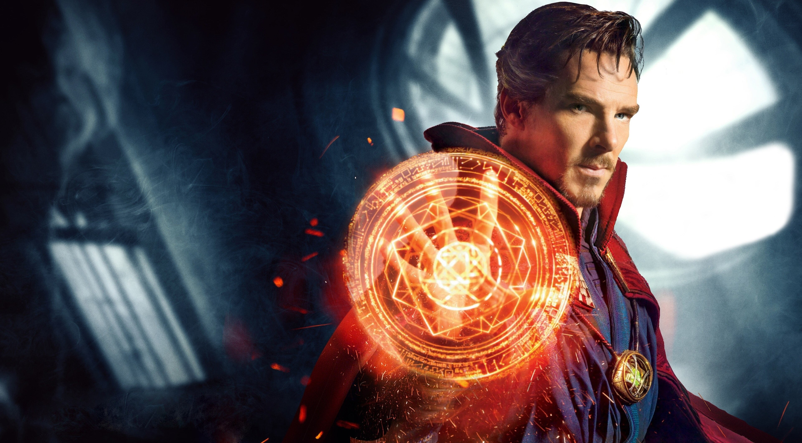

```python
    #'1' Flips image to left side, '0' to upside down and '-1' to combination of both 0 and 1
    flip_img=cv2.flip(img1,1)

    # Showing flipped image
    plt.imshow(flip_img)
```

**Output**:

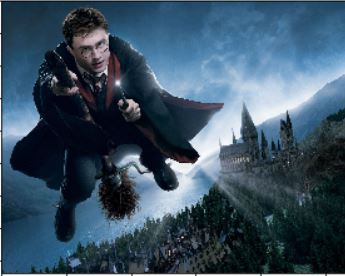

```python
    # Gives the shape (height,width, no.of color channels(RGB)) of image1
    flip_img.shape
```

**Output:**

```
(2093, 2652, 3)
```

```python
    # Gives the shape (height,width, no.of color channels(RGB)) of image2
    img2.shape
```

**Output:**

```
(2127, 3840, 3)
```

```python
    # Both images should be of same size to blend.
    flip_img=cv2.resize(flip_img,(2652,2093))
    img2=cv2.resize(img2,(2652,2093))
```

```python
    # Increase in alpha increases img1 weightage,beta for img2
    blended=cv2.addWeighted(src1=flip_img,alpha=0.9,src2=img2,beta=0.9,gamma=0)
```

**Output**:

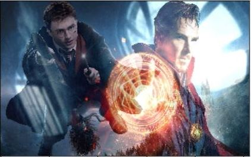

```python
    # Saves the blended img under the name blended.JPG
    cv2.imwrite('blended_img.png',blended)
```

**Output:**

```
True
```

<br/>

<h2 id='why-yaml'> Draw Shapes on Image </h3>

Different shapes can be drawn on an image, to mark an object or create a figure etc.

- Rectangles
- Hollow circles
- Solid Circles
- Lines

and many more can be drawn using OpenCV.

```python
    import cv2 #  opencv library
    import numpy as np
    # Matplotlib used for visualization purpose
    import matplotlib.pyplot as plt
    %matplotlib inline

    # Array of size 512x512 filled with zero as values,
    # to create an image with black color.
    img=np.zeros(shape=(512,512,3),dtype=np.int16)

    # Displays the shape(Height,width,no.of color channels(RGB))
    img.shape
```

**Output:**

```
(512, 512, 3)
```

```python
    # To display the image
    plt.imshow(img)
```

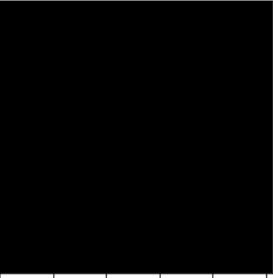

```python
    # cv2.rectangle(image, start_point, end_point, color, thickness)
    cv2.rectangle(img,pt1=(0,0),pt2=(100,100),color=(0,0,255),thickness=10)
```

**Output:**

```
array([[[ 0, 0, 255],
[ 0, 0, 255],
[ 0, 0, 255],
...,
[ 0, 0, 0],
[ 0, 0, 0],
[ 0, 0, 0]],..
```

```python
    plt.imshow(img)
```

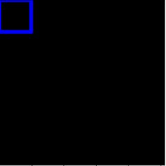

```python
    # cv2.circle(image, center_coordinates, radius, color, thickness)
    cv2.circle(img,center=(150,150),radius=100,color=(255,0,0),thickness=10)
```

**Output:**

```
array([[[ 0, 0, 255],
[ 0, 0, 255],
[ 0, 0, 255],
...,
[ 0, 0, 0],
[ 0, 0, 0],
[ 0, 0, 0]],
[[ 0, 0, 255],
[ 0, 0, 255],
[ 0, 0, 255],
...,
```

```python
    plt.imshow(img)
```

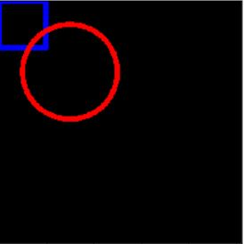

```python
    # Negative values for thickness results in filled/solid circles
    cv2.circle(img,center=(200,200),radius=100,color=(255,255,0),thickness=-10)
```

**Output**:

```
array([[[ 0, 0, 255],
[ 0, 0, 255],
[ 0, 0, 255],
...,
[ 0, 0, 0],
[ 0, 0, 0],
[ 0, 0, 0]],
```

```python
plt.imshow(img)
```

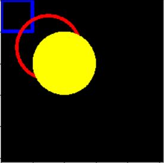

```python
    # cv2.line(image, start_point, end_point, color, thickness)
    cv2.line(img,pt1=(275,275),pt2=(512,512),color=(0,255,0),thickness=10)
```

**Output**:

```
array([[[ 0, 0, 255],
[ 0, 0, 255],
[ 0, 0, 255],
...,
[ 0, 0, 0],
[ 0, 0, 0],
[ 0, 0, 0]],
```

```python
   plt.imshow(img)
```

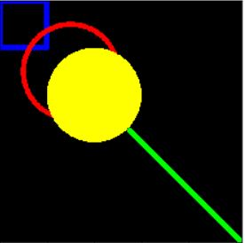

```python
    # Font of the text
    text_style=cv2.FONT_ITALIC

    # Syntax
    #cv2.putText(image, text, org, font, fontScale, color[, thickness[, lineType[, bottomLeftOrigin]]])

    cv2.putText(img,text='HAKUNA MATATA',org=(10,200),fontFace=text_style,fontScale=2,color=(0,0,255),thickness=3,lineType=cv2.LINE_AA)
```

**Output**

```
array([[[0, 0, 0],
[0, 0, 0],
[0, 0, 0],
...,
[0, 0, 0],
[0, 0, 0],
[0, 0, 0]],..
```

```python
   plt.imshow(img)
```

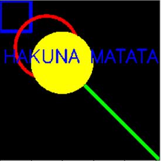

<h2 id='draw'> Draw a Polygon </h2>

```python
    import cv2
    import numpy as np

    # Matplotlib used for visualization purpose
    import matplotlib.pyplot as plt
    %matplotlib inline

    # Array of size 512x512 filled with zero as values,
    # to create an image with black color.
    img=np.zeros(shape=(512,512,3),dtype=np.int16)

    # Assigning vertices to polygon
    poly=np.array([[100,200],[200,100],[400,300],[200,400]],dtype=np.int32)
    poly.shape
```

**Output**:

```
    (4, 2)
```

```python
    # Reshaping according to opencv format
    poly_new=poly.reshape((-1,1,2))
    poly_new.shape
```

**Output:**

```
(4, 1, 2)
```

```python
    # cv2.polylines(img, pts, isClosed, color[, thickness[, lineType[, shift]]])
    cv2.polylines(img,[poly_new],isClosed=True,color=(0,255,0),thickness=10)
```

**Output:**

```
array([[[0, 0, 0],
[0, 0, 0],
[0, 0, 0],
...,
```

```python
    plt.imshow(img)
```

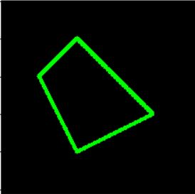

<h2 id='blur'> Blur an image</h2>

There are plenty of blurring techniques available.Some of the methods are:

- Default Blurring Technique
- Gaussian Blurring Technique
- Smoothing Technique
- Median Blurring Technique
- Bilateral Filter Blurring Technique

Lets explore each one of them:

```python
     import cv2  # opencv library

    # Matplotlib used for visualization
    import matplotlib.pyplot as plt
    %matplotlib inline
    import numpy as np

    img=cv2.imread(r'./img/image.JPG')
    img=cv2.cvtColor(img,cv2.COLOR_BGR2RGB)
    plt.imshow(img)
```


```python
    kernel=np.ones((5,5),np.float)/25

    # Default Blurring Technique
    plt.imshow(cv2.blur(img,ksize=(5,5)))
```


```python
    # Gaussian Blurring Technique
    plt.imshow(cv2.GaussianBlur(img,(5,5),0))
```


```python
    # Smoothing Technique
    plt.imshow(cv2.filter2D(img,-1,kernel))
```


```python
    # Median Blurring Technique
    # Reduces unwanted noise
    plt.imshow(cv2.medianBlur(img,5))
```


```python
    # Bilateral Filter Blurring Technique
    # Reduces unwanted noise with sharp edges but slow
    plt.imshow(cv2.bilateralFilter(img,9,75,75))
```


> Try out all these and feel free to ask me doubts via gmail at: **jayachandrika56@gmail.com**

<br/>

> Now you can follow us to explore more interesting topics, in Instagram at: **@code_voyager**

Hope you had fun experimenting with the code.
Have an amazing day!
