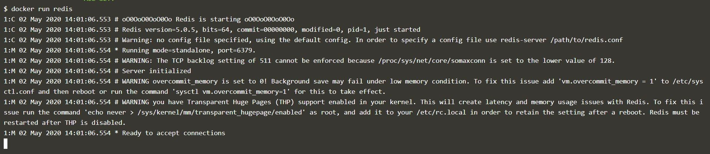

In this Article (Click to skip to that topic):

- [Docker:What the hell is it?](#)
- [But why Docker??](#why-docker)
- [What are Containers](#containers)
- [Images](#images)
- [Magic Commands](#magic)

_Have you ever built an application but it doesn't run on all platforms? Or been sick of installing different dependencies and libraries for each service/component in the application? Dodged the whole nine yards just to deploy, scale and manage a simple application??_

**Then DOCKER is waiting for you!!!**

**<h2 id='what-is-yaml'> Docker:What the hell is it? </h3>**

**Docker is a set of platform as a service products that uses OS-level virtualization to deliver software in packages called containers.** 
(_Well_. . .thats the GOOGLE definition for you! )

To wrap it up simply,it is just a **BOX**!

Imagine,

1. A printer box, we insert a paper and get printed text or colors on it.  
   So how is it working ? Perhaps all the colors and required material is already present in the printer.

2. Consider a car wash, car is sent in, many process like washing, cleaning etc happen and at the end we get a shiny clean car (or a less rusty one).

So, docker is like a printer box or car wash setup in this instance, taking an `input` and giving an `output` basically.
 

> It is basically a box with an application and its related dependencies, libraries etc inside it

 

<h2 id="why-docker">But why docker?</h2>

 

 

Imagine we are building a zoo, we toss all animals like monkeys, Lion and Crocodiles in one big park with _only one kind of food_ and _only one kind of environment_, lets say, land.

The bananas eaten by monkeys can’t be used by Lions and crocodiles, the meat for Lions can’t be eaten by monkeys. Monkeys want trees and crocodiles need a water space in the environment.

In similar way, if we are building an application that has services like a database and framework etc, The libraries and dependencies(food) used by databases (cassandra, postgresql, mongodb etc) may not be compatible/suitable for frameworks (strapi, nodejs express etc).

> Eg: MongoDb version 4.26 might not be compatible/suitable for NodeJs version 4.16.4

To make it easy to develop, run and maintain an application and to operate on all the platforms we came up docker. The problem in zoo example can be solved by providing each animal, a _separate boundary_ with the required food and environment.

<h2 id="containers">Containers</h2>

 

 

In docker we have those separate boundaries called **_containers_**. We place each service in one container with all the libraries and dependencies required for it.

> Container is a completely isolated environment with their own processes, network interfaces and their own mounts.

_Wait, doesnt it look familiar?_ Yes,you are right if you guessed it, they remind us of **Virtual machines**. If its similar to VMs, Why on Earth do we need to use Containers??

Well, Each VM has a separate _OS_ along with libraries, dependencies and application, which increases overload and utilization, making it difficult to operate it in small PCs(though we might not use it there).

Whereas Containers share the same OS, considerably less overload and utilization than VMs. Hence they are just the darlings preferred for application development, deployment and management.

 

<h2 id="images">Images</h2>

These are readymade templates of services like MongoDb, NodeJs etc, to run in containers. We can either use existing images from docker.io or create our own.

Creating an Image of the service helps in shipping it for deployments. Then it is just running a simple command to get the server up and running. We dont have to worry about creating environment, installing dependencies and what not.

<h2 id="magic">Magic commands</h2>

Its time to blow some fairy pixel dust and do some magic!

Lets start with running an image in a container,using run command.

**Run redis image in container**

    docker run redis

 

**List the version details**

    docker version

 

**List the Running containers**

    docker ps

 

**List the Running & Not Running containers**

    docker ps -a

 

**Remove a container**

    docker rm [container ID]

 

> _Note_: To remove a container make sure it is stopped first using stop command.

**List the images**

    docker images

 

**Remove an image**

    docker rmi [image_name]

 

**Just download the image but not run in the container**

    docker pull [image_name]

 

Thank you so much for reading my content. More of such content coming on this blog, so stay tuned.
